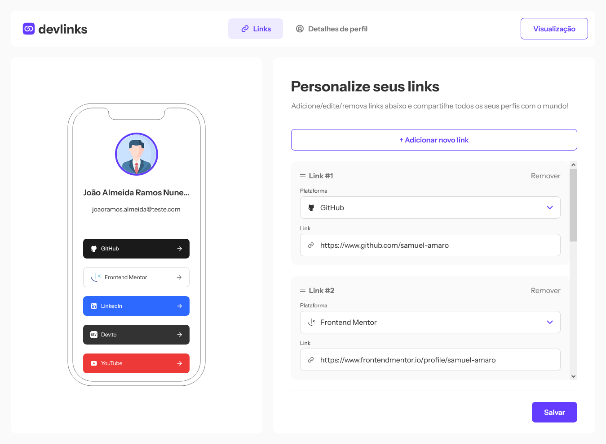
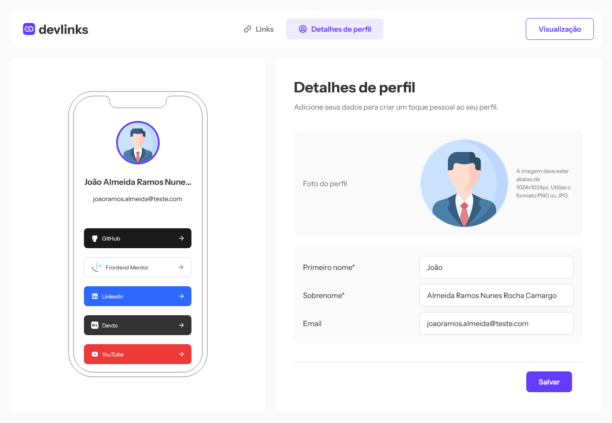
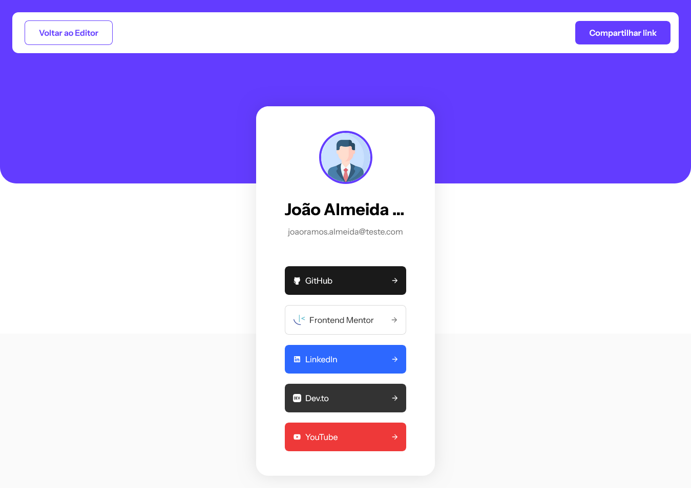

# Aplicativo Web compartilhamento Links

Aplicativo Web compartilhamento de links, permite o usuario construir links customizados, e compartilhalos, criar um perfil com nome e email e seus links para compartilhar com o mundo.

## Índice

- [Visão Geral](#o-desafio)
  - [O desafio](#the-challenge)
  - [Comportamento Esperado App](#comportamento-esperado-app)
  - [Capturas de Tela](#capturas-de-tela)
  - [Links](#links)
- [Meu processo](#meu-processo)
  - [Construído Com](#construido-com)
- [Autor](#autor)

## Overview

### O Desafio

Os usuários devem ser capazes de:

- [x] Crie, leia, atualize, exclua links e veja visualizações na maquete móvel
- [x] Receber validações caso o formulário de links seja enviado sem URL ou com padrão de URL errado para a plataforma
- [x] Arraste e solte links para reordená-los
- [x] Adicione detalhes do perfil, como foto do perfil, nome, sobrenome e e-mail
- [x] Receba validações se o formulário de detalhes do perfil for salvo sem nome ou sobrenome
- [x] Visualize o perfil do devlinks e copie o link para a área de transferência
- [x] Veja o layout ideal da interface dependendo do tamanho da tela do dispositivo
- [x] Veja os estados de foco e foco para todos os elementos interativos na página

### Comportamento Esperado App

- Links
  - [x] Clicar em "Adicionar novo link" adicionará um novo repetidor onde o usuário poderá selecionar a plataforma para adicionar um link e adicionar a URL.
  - [x] Adicionar um novo link deve mostrar imediatamente o link da plataforma na ilustração da maquete móvel, mesmo antes de o formulário ser salvo.
  - [x] Quando o usuário clica em "Salvar", o formulário deve validar a presença de uma URL e garantir que o padrão da URL esteja correto para a plataforma (por exemplo, "https://www.frontendmentor.io/profile/:username" para o Frontend Link do mentor).
  - [x] O usuário deve poder arrastar e soltar clicando e segurando o ícone de hambúrguer de duas linhas no canto superior esquerdo de cada repetidor de link.
  - [x] A ilustração da maquete móvel não é mostrada em layouts de tablets e dispositivos móveis. O usuário precisaria clicar na página de visualização para ver seu perfil. Sinta-se à vontade para brincar com esta UX se quiser incluir a ilustração da maquete móvel para celular e tablet.
- Detalhes de perfil
  - [x] Nome e sobrenome são os únicos campos obrigatórios. Se não houver foto do perfil ou endereço de e-mail, remova as partes necessárias da maquete do celular ou use as iniciais da pessoa dentro do círculo onde estaria a foto do perfil.
- Visualização
  - [x] Clicar em "Compartilhar link" deve copiar o URL atual para a área de transferência do usuário e mostrar a mensagem brinde relevante mostrada no design.

### Capturas de Tela

#### Página Home



#### Página Perfil



#### Paágina Visualização



### Links

- Solution URL: [Add solution URL here](https://your-solution-url.com)
- Live Site URL: [Add live site URL here](https://your-live-site-url.com)

## Meu Processo

### Construido Com

- HTML5
 - Semantic markup
 - Web Acessibility(WCAG)
- CSS
 - Flexbox
 - Grid
 - Normalize CSS
 - Mobile-first workflow
 - Responsive Web Design
 - Bem Metodology
- [React](https://reactjs.org/) - JS library
 - Context API com useReducers
 - Hooks, Custom Hooks
- [Next.js](https://nextjs.org/) - React framework
 - App Router
- CSS Modules
- APIs Web
 - Web Storage API - LocalStorage
 - Clipboard API
 - FileReader/File API
 - Drag and Drop API HTML
- Tools Tests
 - Jest - Test Runner
 - React-Testing-Library - Library Tests Components React
 - Tests Units

## Autor

- Website - [Add your name here](https://meu-portfolio-topaz-alpha.vercel.app/)
- Frontend Mentor - [@yourusername](https://www.frontendmentor.io/profile/samuel-amaro)

## Começando

Primeiro, execute o servidor de desenvolvimento:

```bash
npm run dev
# or
yarn dev
# or
pnpm dev
```